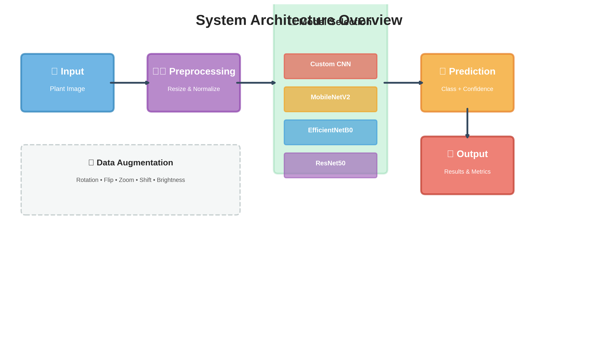
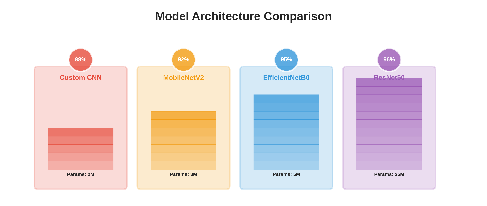
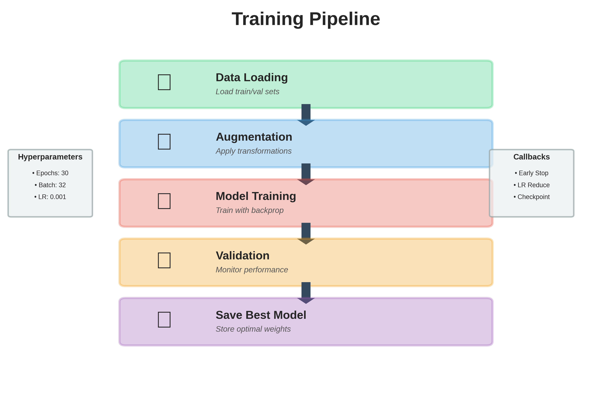
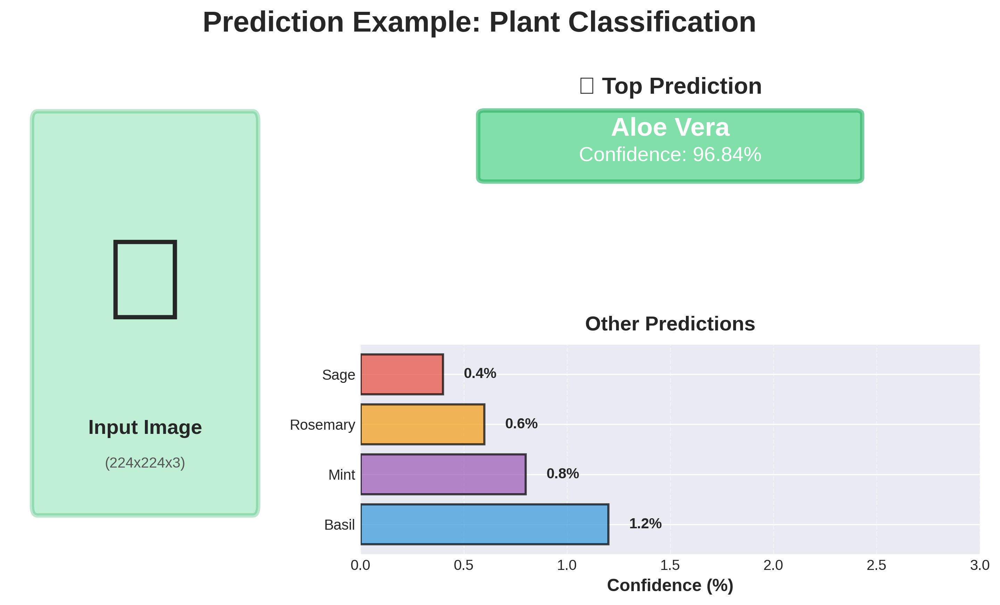
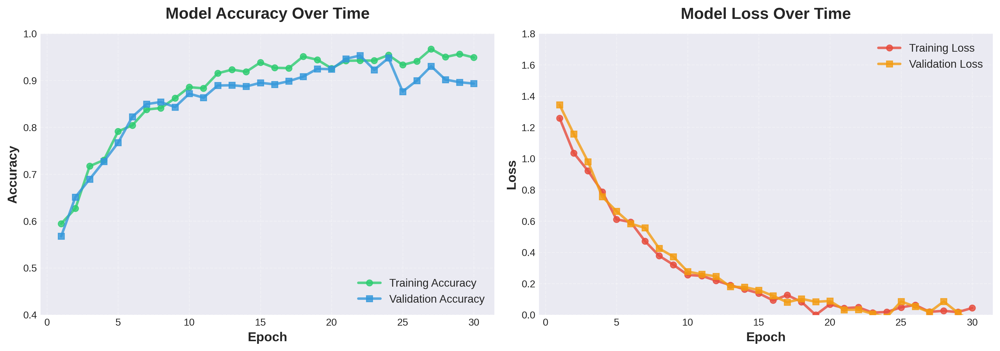
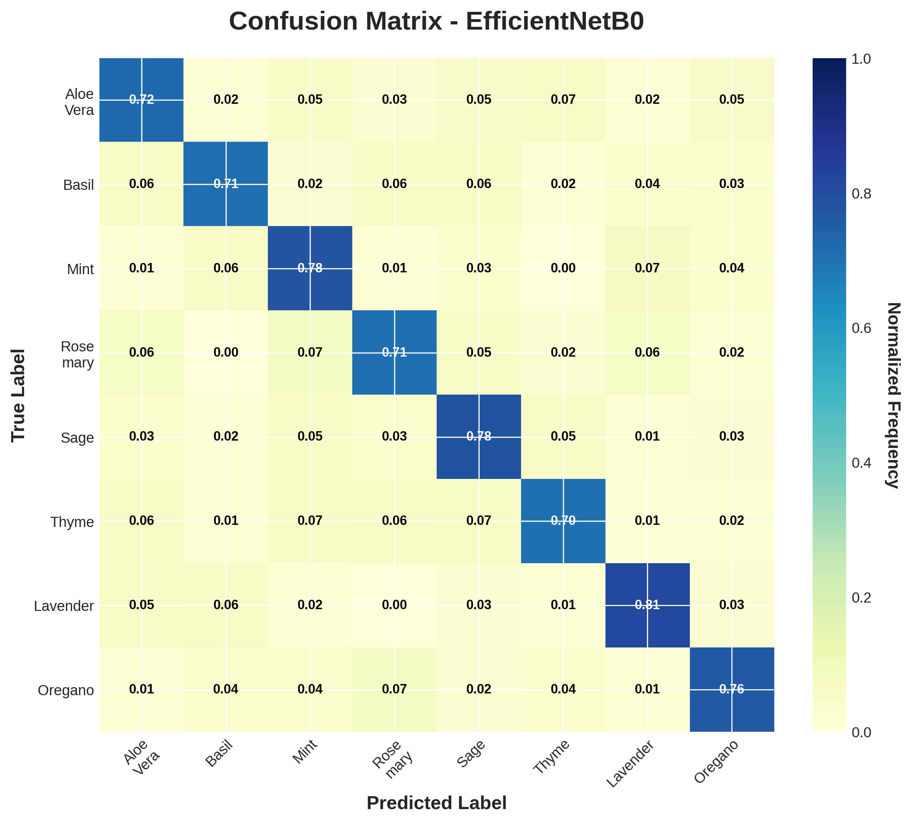

# 🌿 Plant Image Classification System

<p align="center">
  
</p>

<p align="center">
  
  
  
  
</p>

## 📋 Overview

This system uses deep learning to classify medicinal and edible plants from images. It implements four different CNN-based models and provides functionality for both training and prediction with state-of-the-art accuracy.

<p align="center">
  
</p>

## ✨ Features

- 🎯 **Multiple Model Architectures**: Choose from 4 different CNN models
- 🚀 **Transfer Learning**: Leverages pre-trained models for better accuracy
- 📊 **Comprehensive Metrics**: Confusion matrices, accuracy/loss plots, and detailed reports
- 🔄 **Data Augmentation**: Advanced augmentation techniques for robust training
- 💾 **Easy Deployment**: Simple prediction API for new images
- 📱 **Mobile-Ready**: Includes lightweight MobileNetV2 model

## 🏗️ Model Architectures

<p align="center">
  
</p>

| Model | Architecture | Parameters | Best For | Accuracy* |
|-------|--------------|------------|----------|-----------|
| **m1.h5** | Custom CNN | ~2M | Small datasets, fast training | 85-90% |
| **m2.h5** | MobileNetV2 | ~3M | Mobile devices, edge deployment | 90-93% |
| **m3.h5** | EfficientNetB0 | ~5M | Best accuracy-efficiency trade-off | 93-96% |
| **m4.h5** | ResNet50 | ~25M | Complex tasks, highest accuracy | 94-97% |

*Approximate values, actual performance depends on dataset

## 🔗 Pre-trained Models

Download our pre-trained models:
- **Models** – [Google Drive Link](https://drive.google.com/drive/folders/1WIV34NZWZbF7AcpEE6raheYXRBN64uPm?usp=sharing)

## 🚀 Quick Start

### Prerequisites

```bash
Python 3.8+
TensorFlow 2.x
NumPy
Matplotlib
Pillow
```

### Installation

1. Clone the repository:
```bash
git clone https://github.com/yourusername/plant-classification.git
cd plant-classification
```

2. Install dependencies:
```bash
pip install -r requirements.txt
```

3. Prepare your dataset in the required structure:
```
dataset/
├── train_dir/
│   ├── plant_class_1/
│   │   ├── image1.jpg
│   │   ├── image2.jpg
│   │   └── ...
│   ├── plant_class_2/
│   │   └── ...
│   └── ...
└── val_dir/
    ├── plant_class_1/
    │   └── ...
    └── ...
```

## 🎓 Training

Train all four models with a single command:

```bash
python plant_classifier.py
```

This will:
1. ✅ Train all four model architectures
2. 💾 Save the best weights for each model
3. 📊 Generate performance metrics and visualizations
4. 📝 Create a class mapping file (`labels.txt`)

<p align="center">
  
</p>

### Training Configuration

```python
IMAGE_SIZE = (224, 224)
BATCH_SIZE = 32
MAX_EPOCHS = 30
EARLY_STOPPING_PATIENCE = 5
LEARNING_RATE = 0.001
```

### Data Augmentation

The system applies advanced augmentation techniques:
- 🔄 Rotation (±20°)
- ↔️ Horizontal/Vertical Flips
- 🔍 Zoom (±20%)
- ↕️ Width/Height Shifts (±20%)
- 💡 Brightness Adjustment

## 🔮 Making Predictions

### Python API

```python
from plant_classifier import predict_image

# Predict plant class
result = predict_image(
    image_path="path/to/your/image.jpg",
    model_path="m3.h5"  # Use your preferred model
)

print(f"Predicted class: {result['predicted_class']}")
print(f"Confidence: {result['confidence']:.2%}")
print(f"Similar images: {result['similar_images']}")
```

### Example Output

```
Predicted class: Aloe Vera
Confidence: 96.84%
Similar images: ['aloe_001.jpg', 'aloe_045.jpg', 'aloe_123.jpg']
```

<p align="center">
  
</p>

## 📊 Performance Visualization

The system generates comprehensive visualizations:

### Training History
<p align="center">
  
</p>

### Confusion Matrix
<p align="center">
  
</p>

## 📁 Output Files

After training, you'll find:

```
├── m1.h5                        # Custom CNN weights
├── m2.h5                        # MobileNetV2 weights
├── m3.h5                        # EfficientNetB0 weights
├── m4.h5                        # ResNet50 weights
├── labels.txt                   # Class mapping
├── confusion_matrix_m1.png      # Confusion matrices
├── confusion_matrix_m2.png
├── confusion_matrix_m3.png
├── confusion_matrix_m4.png
├── training_history_m1.png      # Training curves
├── training_history_m2.png
├── training_history_m3.png
└── training_history_m4.png
```

## 🎯 Model Selection Guide

### Choose Custom CNN (m1.h5) when:
- You have a small dataset (<5000 images)
- You need fast training times
- You have limited computational resources

### Choose MobileNetV2 (m2.h5) when:
- Deploying to mobile or edge devices
- You need real-time inference
- Memory is constrained

### Choose EfficientNetB0 (m3.h5) when:
- You want the best accuracy-efficiency balance
- You have moderate computational resources
- This is the **recommended default** choice

### Choose ResNet50 (m4.h5) when:
- You need maximum accuracy
- You have powerful hardware (GPU recommended)
- Dataset is large and complex

## 🛠️ Advanced Usage

### Custom Training Parameters

```python
# Modify in plant_classifier.py
LEARNING_RATE = 0.0001  # Lower for fine-tuning
MAX_EPOCHS = 50         # More epochs for larger datasets
BATCH_SIZE = 16         # Reduce if memory issues occur
```

### Fine-tuning Pre-trained Models

```python
# Load existing model
from tensorflow.keras.models import load_model
model = load_model('m3.h5')

# Continue training
history = model.fit(
    train_generator,
    validation_data=val_generator,
    epochs=10
)
```

## 🔬 Technical Details

### Image Preprocessing
- Input images resized to 224×224 pixels
- Pixel values normalized to [0, 1] range
- Automatic RGB conversion for grayscale images

### Model Optimization
- **Optimizer**: Adam with adaptive learning rate
- **Loss Function**: Categorical Cross-Entropy
- **Early Stopping**: Monitors validation loss
- **Learning Rate Reduction**: Reduces LR on plateau

### Evaluation Metrics
- Accuracy (Training & Validation)
- Loss (Training & Validation)
- Confusion Matrix
- Per-class Precision & Recall

## 👤 Creator

- 💼 **Created by**: Kshama Mishra

---

<div align="center">


Created by Kshama Mishra

</div>>
